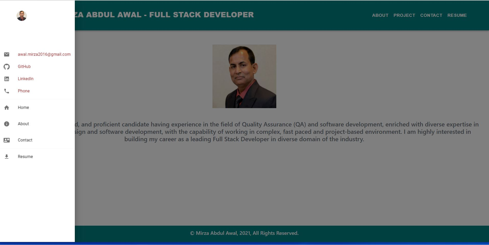

<h1 align="center">REACT PORTFOLIO - MIRZA AWAL 👋</h1>

## Description

*Being a Full Stack Web Developer means being part of a community. Developing a software from the scratch and handing over to the product owner a bug free software is not a easy job. For this a full stack developer has to always remain updated with the technology. An employer will always feel comfortable with a developer who has the knowledge on latest technologies and variety in experience. This brings the necessety of a developer to keep own portfolio always updated so that he/she can present his / her qualifications to the prospective employer with full confidence.Preparing portfolio with React is going to be one of the best option for a developer to present himself with full confidence.*


## Table of Contents

- [Description](#description)
- [Table of Contents](#table-of-contents)
- [App Screenshots](#app-screenshots)
- [Overview Links](#overview-links)
- [User Story](#user-story)
- [Acceptance Criteria](#acceptance-criteria)
- [Installation](#installation)
- [Usage](#usage)
- [Contributing](#contributing)
- [Questions](#questions)


## App Screenshots
- Picture of the About Me Component of the Application.


- Picture of the Contact Component


- Picture of the Home Page with Humbergar Navbar



- Register Option of the Application.


## Overview Links


## User Story

```text
AS AN employer looking for candidates with experience building single-page applications
I WANT to view a potential employee's deployed React portfolio of work samples
SO THAT I can assess whether they're a good candidate for an open position
```

## Acceptance Criteria

```text
GIVEN a single-page application portfolio for a web developer
WHEN I load the portfolio
THEN I am presented with a page containing a header, a section for content, and a footer
WHEN I view the header
THEN I am presented with the developer's name and navigation with titles corresponding to different sections of the portfolio
WHEN I view the navigation titles
THEN I am presented with the titles About Me, Portfolio, Contact, and Resume, and the title corresponding to the current section is highlighted
WHEN I click on a navigation title
THEN I am presented with the corresponding section below the navigation without the page reloading and that title is highlighted
WHEN I load the portfolio the first time
THEN the About Me title and section are selected by default
WHEN I am presented with the About Me section
THEN I see a recent photo or avatar of the developer and a short bio about them
WHEN I am presented with the Portfolio section
THEN I see titled images of six of the developer’s applications with links to both the deployed applications and the corresponding GitHub repository
WHEN I am presented with the Contact section
THEN I see a contact form with fields for a name, an email address, and a message
WHEN I move my cursor out of one of the form fields without entering text
THEN I receive a notification that this field is required
WHEN I enter text into the email address field
THEN I receive a notification if I have entered an invalid email address
WHEN I am presented with the Resume section
THEN I see a link to a downloadable resume and a list of the developer’s proficiencies
WHEN I view the footer
THEN I am presented with text or icon links to the developer’s GitHub and LinkedIn profiles, and their profile on a third platform (Stack Overflow, Twitter) 
```

## Installation
💾     
- npm install 
- npm install express
- npm install apollo-boost

## Tools
- React

## Usage
💻   
  
Run the following command at the terminal:
  
`npm start`

## Questions
✉️ Contact me with any questions: [email](mailto:awal.mirza2016@gmail.com) , [LinkedIn](https://www.linkedin.com/in/mirza-awal-5972511b5/)<br />